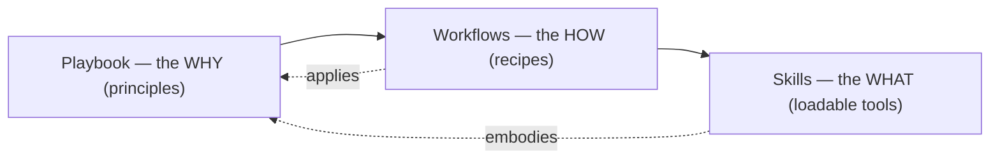

# agent-vault

*How I actually work with coding agents.*

I build and ship production software with coding agents (Claude Code, Codex) as my primary
interface. This is the curated set of **workflows, skills, and the playbook** behind that: the
operating system I use to get real, reviewed, production-grade code out of agents, not just demos.

Everything here is battle-tested on real products ([Delphy](https://delphy.network),
[AstraNova](https://astranova.live), [fermartz.com](https://fermartz.com)), with honest notes on
what worked and what I'd skip. The mistakes are written down on purpose: the "Receipt" and
"Failure mode" callouts are the parts you can't get from a tutorial.

## The three pillars

| Pillar | What it is | Think of it as |
|---|---|---|
| **Playbook** | The principles. *Why* I work the way I do. | the **why** |
| **Workflows** | Repeatable, end-to-end recipes. *How* I run a piece of work. | the **how** |
| **Skills** | Loadable `SKILL.md` tools you can drop into your own agent. | the **what** |

The pillars cross-link both directions: every workflow cites the principles it applies and the
skills it uses; every skill points back to the principle behind it. Enter from any side.

## Two ways to read this

- **You want a tool you can use today** -> browse [`skills/`](./skills) and
  [`workflows/`](./workflows), copy what's useful.
- **You want to see how I think** (hiring managers, this is you) -> start with the **Playbook**
  and the flagship workflow below. The tools are the receipts; the thinking is the point.

## Start here: The Blueprint

The one workflow that captures my whole approach:

### → [The Blueprint](./workflows/the-blueprint.md)
*Plan → build → verify → review → ship, with a second model as the skeptic.*

One model builds, a **different** model reviews adversarially, and nothing ships until that
independent pass approves it. It includes the real loop, a diagram of every file involved, and
the lessons that cost me review rounds before I wrote them down.

## Using the skills

Each skill is a self-contained `SKILL.md`. To use one in your own setup, copy its folder into your
project's `.claude/skills/` (or `~/.claude/skills/` for all projects), and your agent can invoke it.

## Maturity legend

Every doc declares how proven it is, so you know what you're getting:

- **battle-tested** — used repeatedly on shipped products
- **working** — solid, used at least a few times
- **experimental** — promising, still shaking out

## Status

Growing in public. Live today: four playbook principles plus the `.agent/` convention, the
Blueprint workflow, and five skills. More of each gets added piece by piece (same way I build
everything).

## About

Built by **Fer Martz** — engineer building production AI products: agents, the agentic web, and the
tooling that drives them. [fermartz.com](https://fermartz.com) ·
[github.com/fermartz](https://github.com/fermartz) ·
[LinkedIn](https://linkedin.com/in/fernando-martinez-valdez)

## License

MIT. Use anything here. If it saves you a review round, that's the point.
