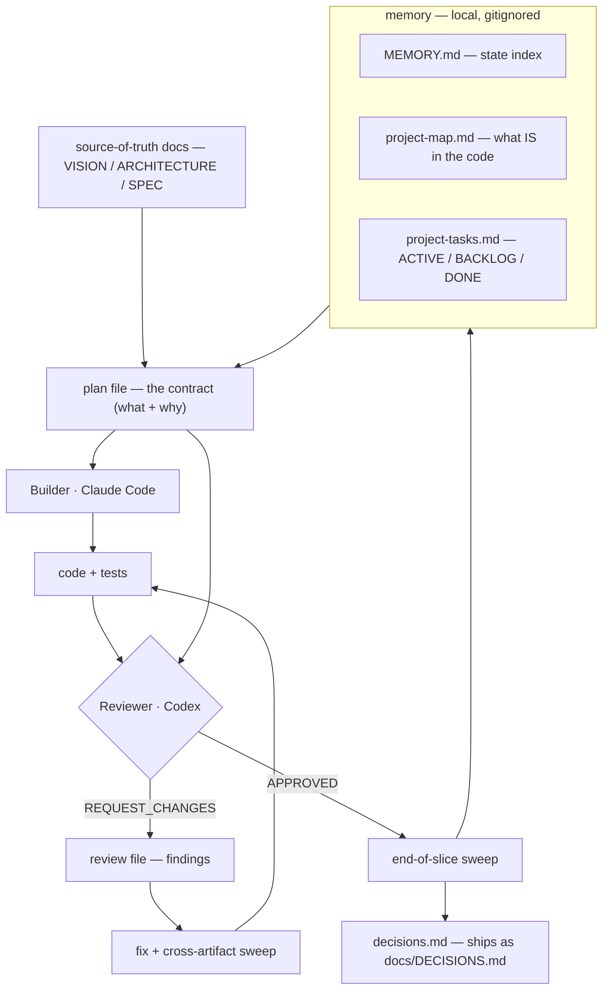

# The Blueprint

*Plan → build → review → ship, with a second model as the skeptic.*

This is my default operating loop for getting real, production-grade code out of coding agents.
The headline idea: **one model builds, a *different* model reviews, and nothing ships until an
independent adversarial pass approves it.** Everything else here exists to keep that loop short
and honest.

> Drawn from how I built **Delphy Agent** (Tauri + React, 450+ tests) slice by slice. The lessons
> and failure-modes below are real — they cost me review rounds before I wrote them down.

> **Want your agent to just *run* this?** Load the executable twin:
> [`skills/blueprint`](../skills/blueprint/SKILL.md). This page is the *why*; the skill is the *do-this*.

## When to use this

- Any non-trivial change (a feature, a refactor, a subsystem) where correctness matters.
- When you want an audit trail of *what* you built and *why* it was approved.

**When NOT to:** a one-line fix, a typo, a throwaway script. The loop has overhead; don't tax a
trivial change with it. Match the ceremony to the stakes.

## The loop

```
plan → build → review → fix → SWEEP → verify → re-review (loop until clean) → approve
```

| Role | Who |
|---|---|
| **Planner** | You (or an agent driving the workflow) — writes the plan, gets approval |
| **Builder** | The coding agent (e.g. Claude Code) — implements |
| **Reviewer** | A *different* model (e.g. Codex CLI) — audits the diff adversarially |
| **Approver** | You — final sign-off |

Using a second model as reviewer is the whole point: the builder is biased toward "it works";
an independent reviewer is biased toward "prove it." That tension is where bugs die.
(See playbook → [[adversarial-verification]].)

## The files in play

How information flows through the artifacts (this renders as a diagram on GitHub):



And the same thing as a list — every file, what it is, and when it's touched:

| File | What it is | Touched |
|---|---|---|
| **plan file** (`plans/<date>_<feature>.md`) | The contract: what to build + why | Written before coding; boxes checked at the end |
| **code + tests** | The actual change | The build step |
| **review file** (`reviews/<task>.md`) | The reviewer's findings | Written *only* on REQUEST_CHANGES |
| **`MEMORY.md`** | Always-loaded state index (phase, shipped, paths) | Read at start; updated in the sweep |
| **`<project>-map.md`** | Source map — what IS in the code | Read before building; updated in the sweep |
| **`<project>-tasks.md`** | Work items (ACTIVE / BACKLOG / DONE) | Read at start; moved to DONE at the end |
| **`decisions.md`** → `docs/DECISIONS.md` | Architecture decisions + rationale | Appended when a real choice is made |
| **source-of-truth docs** (VISION / ARCHITECTURE / SPEC / ROADMAP) | The project's north stars | Read before major changes |

> **Local vs public:** `MEMORY.md`, the map, and the tasks file stay **local (gitignored)** —
> they're working memory you regenerate as you go. Only `decisions.md` ships publicly (as
> `docs/DECISIONS.md`). Maps reflect code reality; tasks reflect intent; **code always wins over both.**

## 1. Before you build

1. Read the source map and task file (see [[memory-system]]) — know what *is* in the code before you change it.
2. Read the relevant docs / schemas / examples for the area you're touching.
3. Identify the files likely to change.
4. For non-trivial work, **write a short plan and get approval BEFORE coding.**
5. Make the smallest clean change that satisfies the task. No unrelated rewrites.

### Plan scope and size — keep it a contract, not a spec

Aim for **under 200 lines.** A plan says *what* to build and *why*, not *how*. Implementation
details (state machines, pseudocode, exact type signatures, message shapes) belong in the code.

- **In the plan:** purpose, success criteria, scope (in/out), locked design decisions, checkpoints, risks + mitigations.
- **Not in the plan:** pseudocode, function signatures, exhaustive types, step-by-step state transitions.

> **Receipt (Delphy Agent, MCP slice B):** a plan grew to 339 lines / 70KB across 4 revision
> rounds. Each round added implementation detail to "fix" a reviewer finding, which created new
> surface area for the next round to catch. The reviews were accurate but the errors were
> self-inflicted — the plan over-specified things that should have been decided while coding.
> A plan that spells out *how* becomes a second source of truth the reviewer audits against the
> code, generating rounds that catch documentation drift, not bugs.

## 2. Before you finish

Run the project's full verification suite:
```bash
[test]            # e.g. npm test / vitest run
[lint / typecheck]
[schema / artifact checks]
git diff --check  # trailing whitespace, conflict markers
```

Then hand the reviewer a tailored, **adversarial** prompt. The one I use:
```
codex exec "Review the uncommitted diff. Plan: <plan-file>. Check: spec compliance, bugs,
missing tests, security, scope creep, overengineering. Do not modify files. Be concise —
output ONLY APPROVED or REQUEST_CHANGES followed by a one-line summary. If REQUEST_CHANGES,
write full details to <reviews-dir>/<task>.md"
```
- **REQUEST_CHANGES** → read the review, fix blockers, run the sweep (§3), re-verify, re-review.
- **APPROVED** → proceed. Record the verdict in the task's DONE entry.

## 3. Between review iterations (the step everyone skips)

**Blocking step after every fix, before re-issuing the review.** Skipping this is the #1 cause of
multi-round loops where each round catches new artifact drift.

1. **List what the fix changed** — new/removed identifiers, moved file paths, phrases that no longer match reality. Write it down; don't trust memory.
2. **Grep each removed/changed term** across your memory + map + tasks + decisions + architecture docs + the active plan. Cast wider than feels necessary.
3. **For each hit, decide:** update to shipped wording, or contextualize as history ("plan initially proposed… review round N caught…"). Silence is not an option.
4. **Run the verification suite.**
5. **Re-grep the same terms.** Anything still stale (outside contextualized history) → fix now.
6. **Only now re-review** — tell the reviewer what changed and what the sweep covered.

> **Failure mode:** patch the one stale reference the reviewer named, re-issue, and round N+1
> catches three more. The grep in step 2 is the gate. Extra greps cost microseconds; a wasted
> review round costs minutes plus the reviewer's patience. (See skill → [[cross-artifact-sweep]].)

## 4. End-of-slice sweep (before saying "done")

The iteration sweep keeps the *loop* short; this final pass — run *after* it converges to
APPROVED — makes sure nothing structural was missed:

- [ ] **State** — update your always-loaded index (date, phase, capabilities, last shipped). Re-read after editing.
- [ ] **Map** — (a) add/remove every file created/moved/deleted in the file index (list the actual files, not just a headline); (b) re-read the *prose* of any subsystem that moved (grep catches renamed symbols, NOT stale sentences); (c) bump the "last structural change" line.
- [ ] **Tasks** — move ACTIVE → DONE with summary + verdict; prune backlog; archive when it gets long.
- [ ] **Decisions** — log any architectural choice with date + rationale.
- [ ] **Plan** — check the boxes.
- [ ] **Constants/enums** — if enums, kind lists, or URL patterns changed, grep for stale values.

> **Failure mode:** "updated the map" while leaving 6 new files unlisted, and a prose section
> describing old ownership survived because there was no symbol to grep for. After editing each
> artifact, RE-READ it. Not optional.

Do not commit unless explicitly asked.

## Coding rules (what the builder follows)

- Prefer simple, explicit code. Smallest clean change that satisfies the task.
- Don't refactor surrounding code unless the task is refactoring.
- No abstractions for hypothetical future needs. No error handling for impossible cases.
- Default to no comments — only when the *why* is non-obvious.
- Never touch secrets/.env. Don't change unrelated formatting. Preserve docs/examples unless that's the task.

## Review expectations (what the reviewer checks)

Spec compliance · bugs/regressions · missing tests · security & validation · overengineering · scope creep beyond the plan.

---

### Why this works
The builder optimizes for "done"; the independent reviewer optimizes for "wrong." Keeping them as
*different models* prevents the builder from grading its own homework. The sweeps exist because the
expensive failure isn't a bug — it's a review *round* wasted on drift between code and docs. Plan
small, build small, verify hard, let a skeptic sign off.

**Playbook:** [[memory-system]] · [[plan-build-review]] · [[adversarial-verification]] · [[context-hygiene]]
**Skills:** [[code-review]] · [[cross-artifact-sweep]]
