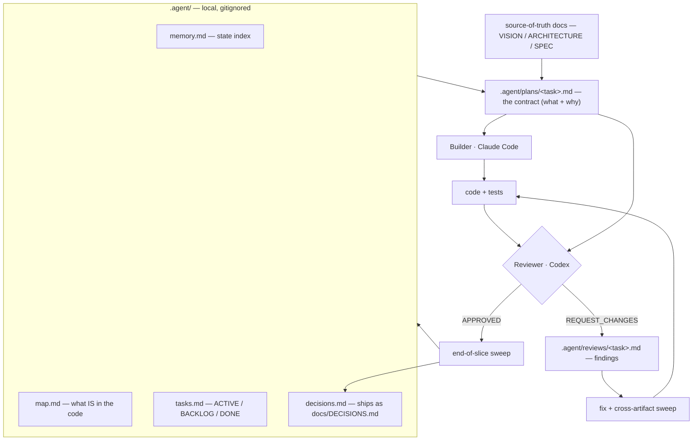

# The Blueprint

*Plan → build → verify → review → ship, with a second model as the skeptic.*

This is my default operating loop for getting real, production-grade code out of coding agents.
The headline idea: **one model builds, a *different* model reviews, and nothing ships until an
independent adversarial pass approves it.** Everything else here exists to keep that loop short
and honest. (That's for features and risky changes; a typo gets a lighter path, see
[change levels](#size-the-ceremony-change-levels).)

> Drawn from how I built **Delphy Agent** (Tauri + React, 450+ tests) slice by slice. The lessons
> and failure-modes below are real — they cost me review rounds before I wrote them down.

> **Want your agent to just *run* this?** Load the executable twin:
> [`skills/blueprint`](../skills/blueprint/SKILL.md). This page is the *why*; the skill is the *do-this*.

## When to use this

- Any non-trivial change (a feature, a refactor, a subsystem) where correctness matters.
- When you want an audit trail of *what* you built and *why* it was approved.

**How much of it to run:** match the ceremony to the stakes. Rate the change first with the levels
below. A throwaway script needs none of it.

## Size the ceremony: change levels

The full loop on a one-line change is waste, and skipping it on a risky one is how bugs ship. So
**rate every change before you start, say the rating out loud** ("S change, about a minute"), and
run only that level's checks. The human can bump any rating. **When unsure, go one level up.**

| Level | Examples | Checks | Rough time |
|---|---|---|---|
| **S: copy** | a title, a label, wording, a comment | the cheap static checks (lint, typecheck) and the one test that names the text; a one-line task note | 1–2 min |
| **M: one screen or module** | layout, style, one component, one function | S + the unit tests, and only the end-to-end tests and snapshots for that screen or module; show the result | a few min |
| **L: feature** | a new screen, data logic, several screens or modules | the full loop: a plan if non-trivial, the full suite, end-to-end on real data, **second-model review**, end-of-slice sweep | 10–15 min plus review |
| **XL: risky** | security, auth, data writes, a new dependency, a schema, anything the project marks as a boundary | L, with the plan required | as long as it takes |

- **Never S or M:** security, auth, anything that writes user data, dependencies, schemas, and the
  files the project lists as boundaries. Those start at XL whatever their size.
- **Stale snapshots are fine for a moment.** An S change may leave generated baselines (screenshots,
  snapshots) stale. The next M-or-larger change refreshes the affected ones and says so.
- **The levels set the checks, nothing else.** Committing still waits for the human (§4).
- **Write your project's own table** with its real commands and file names (which test "names the
  text", which files are boundaries). The levels and the rules above stay the same.

> **Receipt (Brain by Summer AI, 2026-10-05):** changing one page title took about 13 minutes. The
> agent ran everything: all 84 screenshot baselines, then the full verify with four production
> builds. The owner: "for a change of just changing the title it should take less than a minute."
> Brain now rates every change S/M/L/XL first; a title is an S.

## The loop

```
recon → plan → build → verify → review → (fix → class-sweep → verify → re-review)* → approve
```

| Role | Who |
|---|---|
| **Planner** | You (or an agent driving the workflow) — writes the plan, gets approval |
| **Builder** | The coding agent (e.g. Claude Code) — implements |
| **Reviewer** | A *different* model (e.g. Codex CLI) — audits the diff adversarially |
| **Approver** | You — final sign-off |

Using a second model as reviewer is the whole point: the builder is biased toward "it works";
an independent reviewer is biased toward "prove it." That tension is where bugs die.
(See playbook → [Don't Grade Your Own Homework](../playbook/adversarial-verification.md).)

## The files in play

How information flows through the artifacts (this renders as a diagram on GitHub):



And the same thing as a list — every file, what it is, and when it's touched:

| File | What it is | Touched |
|---|---|---|
| **plan file** (`.agent/plans/<date>_<feature>.md`) | The contract: what to build + why | Written before coding; boxes checked at the end |
| **code + tests** | The actual change | The build step |
| **review file** (`.agent/reviews/<task>.md`) | The reviewer's findings | Written *only* on REQUEST_CHANGES |
| **`.agent/memory.md`** | Always-loaded state index (phase, shipped, paths) | Read at start; updated in the sweep |
| **`.agent/map.md`** | Source map — what IS in the code | Read before building; updated in the sweep |
| **`.agent/tasks.md`** | Work items (ACTIVE / BACKLOG / DONE) | Read at start; moved to DONE at the end |
| **`.agent/decisions.md`** → `docs/DECISIONS.md` | Architecture decisions + rationale | Appended when a real choice is made |
| **source-of-truth docs** (VISION / ARCHITECTURE / SPEC / ROADMAP) | The project's north stars | Read before major changes |

> **Local vs public:** keep these together in one [`.agent/` folder](../playbook/the-agent-folder.md).
> `memory.md`, the map, and the tasks file stay **local (gitignored)** — they're working memory you
> regenerate as you go. Only `decisions.md` ships publicly (as `docs/DECISIONS.md`). Maps reflect
> code reality; tasks reflect intent; **code always wins over both.**

## 0. Recon — before you plan (the step that kills review rounds)

Plan v1 must be written from the **territory, not the map in your head.** Before a single plan
line, the planner runs an exhaustive read-only investigation of everything the plan will touch,
and the plan cites what was found. Three rules:

1. **Inventory the live state first.** Whatever the plan touches — cloud accounts, DB schemas,
   dependency trees, API consumers — enumerate it *completely* with read-only commands before
   proposing changes. Not "the parts I think matter": if the plan claims a boundary (security,
   compatibility, cost), enumerate the entire class the boundary is drawn over.
2. **Verify external facts against live sources, never memory.** Prices, current versions, API
   defaults, provider behaviors — training data is stale by definition. Every externally-sourced
   fact in the plan gets checked against the live API/docs at plan time.
3. **No claim without its command.** Every factual claim in a plan carries the reproducible
   read-only command that proves it — and the command was actually *run* before the claim was
   written. If you can't name the command, you're asserting, not knowing. An adversarial reviewer
   will run it for you, and you will not enjoy the result.

> **Receipt (fermartz-infra, bootstrap+RDS plan, 2026-08-23):** plan v1 quoted a "$14/mo" RDS
> floor from memory (missed the $3.65 public-IPv4 charge), called Postgres 17 "latest major"
> (18 was current), and claimed a clean security boundary in an account that — when the reviewer
> actually looked — held 2 admin console users, 7 admin-attached shell users, and 45 workload
> roles including several admin-equivalent ones. **Seven REQUEST_CHANGES rounds**, nearly all
> catching things a pre-plan recon would have surfaced in 30 minutes. The reviewer never had
> to be clever — it just had to look at reality before I did.

## 1. Before you build

1. Read the source map and task file (see [Give the Agent a Memory](../playbook/memory-system.md)) — know what *is* in the code before you change it.
2. Read the relevant docs / schemas / examples for the area you're touching.
3. Identify the files likely to change.
4. For non-trivial work, **write a short plan and get approval BEFORE coding.**
5. Make the smallest clean change that satisfies the task. No unrelated rewrites.

### Plan scope and size — keep it a contract, not a spec

Aim for **under 200 lines.** A plan says *what* to build and *why*, not *how*. Implementation
details (state machines, pseudocode, exact type signatures, message shapes) belong in the code.

- **In the plan:** purpose, success criteria, scope (in/out), locked design decisions, checkpoints, risks + mitigations.
- **Not in the plan:** pseudocode, function signatures, exhaustive types, step-by-step state transitions.

> **Receipt (Delphy Agent, MCP slice B):** a plan grew to 339 lines / 70KB across 4 revision
> rounds. Each round added implementation detail to "fix" a reviewer finding, which created new
> surface area for the next round to catch. The reviews were accurate but the errors were
> self-inflicted — the plan over-specified things that should have been decided while coding.
> A plan that spells out *how* becomes a second source of truth the reviewer audits against the
> code, generating rounds that catch documentation drift, not bugs.

## 2. Before you finish

This section is the L and XL path. An S or M change runs only its level's checks (see
[change levels](#size-the-ceremony-change-levels)) and skips the review.

Run the project's full verification suite:
```bash
[test]            # e.g. npm test / vitest run
[lint / typecheck]
[schema / artifact checks]
git diff --check  # trailing whitespace, conflict markers
```

For anything with a runtime surface, **exercise the changed flow end-to-end** — run the app, hit
the endpoint, click the button. A green suite proves the tests pass, not that the feature works.

Then hand the reviewer a tailored, **adversarial** prompt. The one I use:
```
codex exec "Review the uncommitted diff. Plan: <plan-file>. Check: spec compliance, bugs,
missing tests, security, scope creep, overengineering. Do not modify any project files —
the only file you may create is the review report. Be concise: output ONLY APPROVED or
REQUEST_CHANGES followed by a one-line summary. If REQUEST_CHANGES, write full details to
.agent/reviews/<task>.md"
```

`codex exec` is just my current second model — the requirement is **a different model with no
shared context**, not Codex specifically. Swap in whatever you have (`gemini`, a separate Claude
Code session). No second model installed? A **fresh session of the same model** with the same
adversarial prompt is weaker but far better than self-review in the same conversation — the bias
to defend is mostly *context* attachment, only partly model identity.

- **REQUEST_CHANGES** → read the review, fix blockers, run the sweep (§3), re-verify, re-review.
- **APPROVED** → proceed. Record the verdict in the task's DONE entry.

**Round budget: after 3 REQUEST_CHANGES rounds, stop looping.** A loop that isn't converging
usually means the *plan* is the problem — over-specified or mis-scoped — not the code. Re-examine
the plan with the approver before round 4. (That's the 339-line-plan receipt above, encoded as a
rule instead of a cautionary tale.)

## 3. Between review iterations (the step everyone skips)

**Blocking step after every fix, before re-issuing the review.** Skipping this is the #1 cause of
multi-round loops where each round catches new artifact drift.

1. **Fix the class, not the instance.** When the reviewer finds a defect, ask "what is the
   *category* of this defect, and where else does that category live?" — then audit the whole
   category before revising. One stale admin user means *enumerate everything that can hold
   admin*; one wrong price means *re-verify every price in the plan*. Fixing only the named
   instance guarantees the reviewer finds its sibling next round (fermartz-infra: an
   admin-equivalent role was deleted in round 5; its identically-policied twin was found in
   round 6 — one `list-roles` sweep would have caught both).
2. **List what the fix changed** — new/removed identifiers, moved file paths, phrases that no longer match reality. Write it down; don't trust memory.
3. **Grep each removed/changed term** across your memory + map + tasks + decisions + architecture docs + the active plan. Cast wider than feels necessary.
4. **For each hit, decide:** update to shipped wording, or contextualize as history ("plan initially proposed… review round N caught…"). Silence is not an option.
5. **Run the verification suite.**
6. **Re-grep the same terms.** Anything still stale (outside contextualized history) → fix now.
7. **Only now re-review** — tell the reviewer what changed and what the sweep covered.

> **Failure mode:** patch the one stale reference the reviewer named, re-issue, and round N+1
> catches three more. The grep in step 3 is the gate. Extra greps cost microseconds; a wasted
> review round costs minutes plus the reviewer's patience.
> (See skill → [cross-artifact-sweep](../skills/cross-artifact-sweep/SKILL.md).)

## 4. End-of-slice sweep (before saying "done")

For an S or M change the sweep is a one-line task note (plus the map, if files were added or
moved). For L and XL, the full pass below.

The iteration sweep keeps the *loop* short; this final pass — run *after* it converges to
APPROVED — makes sure nothing structural was missed:

- [ ] **State** — update your always-loaded index (date, phase, capabilities, last shipped). Re-read after editing.
- [ ] **Map** — (a) add/remove every file created/moved/deleted in the file index (list the actual files, not just a headline); (b) re-read the *prose* of any subsystem that moved (grep catches renamed symbols, NOT stale sentences); (c) bump the "last structural change" line.
- [ ] **Tasks** — move ACTIVE → DONE with summary + verdict; prune backlog; archive when it gets long.
- [ ] **Decisions** — log any architectural choice with date + rationale.
- [ ] **Plan** — check the boxes.
- [ ] **Constants/enums** — if enums, kind lists, or URL patterns changed, grep for stale values.

> **Failure mode:** "updated the map" while leaving 6 new files unlisted, and a prose section
> describing old ownership survived because there was no symbol to grep for. After editing each
> artifact, RE-READ it. Not optional.

Do not commit unless explicitly asked.

## Coding rules (what the builder follows)

- Prefer simple, explicit code. Smallest clean change that satisfies the task.
- Don't refactor surrounding code unless the task is refactoring.
- No abstractions for hypothetical future needs. No error handling for impossible cases.
- Default to no comments — only when the *why* is non-obvious.
- Never touch secrets/.env. Don't change unrelated formatting. Preserve docs/examples unless that's the task.

## Review expectations (what the reviewer checks)

Spec compliance · bugs/regressions · missing tests · security & validation · overengineering · scope creep beyond the plan.

---

### Why this works
The builder optimizes for "done"; the independent reviewer optimizes for "wrong." Keeping them as
*different models* prevents the builder from grading its own homework. The sweeps exist because the
expensive failure isn't a bug — it's a review *round* wasted on drift between code and docs. Plan
small, build small, verify hard, let a skeptic sign off.

**Playbook:** [memory-system](../playbook/memory-system.md) · [plan-build-review](../playbook/plan-build-review.md) · [adversarial-verification](../playbook/adversarial-verification.md) · [context-hygiene](../playbook/context-hygiene.md)
**Skills:** [code-review](../skills/code-review/SKILL.md) · [cross-artifact-sweep](../skills/cross-artifact-sweep/SKILL.md)
